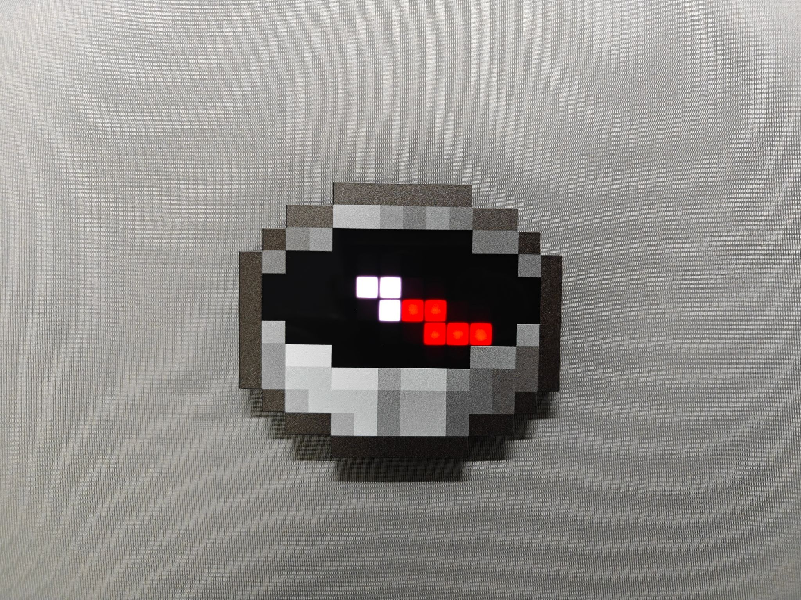

# PixelCompass 文件说明与制作指南

欢迎来到 PixelCompass 硬件资料库！本仓库包含了制作现实版《我的世界》磁石罗盘所需的全套开源生产资料。

完整图文教程： 具体的焊接步骤、BOOT 烧录截图等内容，请移步我的博客查看：[PixelCompass：一个成本更低、支持网页配置的《我的世界》实体罗盘](https://chaosgoo.com/pixelcompass-a-better-minecraft-compass-irl/)。

本仓库包含了用于 PCB 制造的Gerber 文件、电路原理图以及辅助焊接工具。

* **`Gerber` 文件夹：** 存放用于生产的文件，上传到任何 PCB 样板工厂（如立创商城、捷配等）一键下单打板。
* **`ibom.html` (交互式 BOM)：** 手工焊接的辅助工具（它还支持将物料清单导出为 `.xlsx` 表格）。
    * **注意：** 在交互式BOM网页列表中点击元器件，即可高亮显示其在电路板上的位置。
    * 物料清单中标记为 **"ANT-F-2-2.4G-1.0mmFR4-WCH"** 的零件是一个**板载天线占位符**，不对应任何实体电子料，直接忽略即可。
* **`Acrylic_Panel_2026-05-23.epanm`:** 用于生产亚克力面板的文件, 从立创EDA导出
* **`PET.dwg`:** 用于裁切夹层 PET 匀光膜的图纸。

---

# 3D 打印外壳与结构件

所有 3D 打印相关文件和已托管至 **MakerWorld**：
[在 MakerWorld 获取 3D 打印文件](https://makerworld.com/en/models/2834513-minecraft-compass-irl%23profileId-3158927)
**该版本与之前的ESP32C3版并不兼容**
打印盘（Plates）拆分为了以下几个内容：
* **盘 1（标准版 - 半透亚克力方案）：** 包含标准的外壳 `body` 部件。用于搭配前表面 **1mm 厚、顶面 UV 印刷的黑色半透亚克力面板**,需要在夹层中放置一张 **PET LGT075J 扩散膜**。
* **盘 2（多色版 - 无需亚克力）：** 包含一个完整的 `faceplate` 结构件，适合进行多色打印。耗材颜色推荐（参考 TiX 的配色方案）：
    * 黑、白两色：无特定品牌要求。
    * 深灰色：推荐 **拓竹官方耗材 10105**（或同等颜色）。
    * 浅灰色：推荐 **拓竹官方耗材 16101**（或同等颜色）。

* **盘 3（实验性双 AMS 六色版）：** 这是我早期的双 AMS 测试方案。我买了一堆料来测试打印效果，但始终没找到最“完美”的效果，因此本盘仅供参考。

---

## 额外硬件注意事项

* **电池规格：** 外壳内部的电池空间是专为 **601535 锂电池 (280mAh)** 设计的。如果你想用更大容量的电池以获取更长的续航，就需要自行修改 3D 外壳的源文件以适配更大的电池尺寸。

---

## 固件与激活

* **在[Release](https://github.com/chaosgoo/PixelCompass_HW/releases)页面：** 可以下载编译好的固件。请使用 WCH（沁恒）官方提供的 **WCHISPTool** 烧录工具将其烧录至电路板中。
    * 也可以从我的夸克网盘转存获取本repo的所有文件, 链接为[https://pan.quark.cn/s/7ac388ab6cd9#/list/share](https://pan.quark.cn/s/7ac388ab6cd9#/list/share)
* **在线配置网页（Web Dashboard）：** [https://dash.chaosgoo.com/pixelcompass/](https://dash.chaosgoo.com/pixelcompass/)
* **如何激活：** 设备首次连接 Dashboard 后需要输入免费的激活码。请直接前往我的 Ko-fi 店铺免费申领（系统会自动发信）：**[在 Ko-fi 免费获取激活码](https://ko-fi.com/s/ba9368da91)**。

更多详情请访问博客文章了解:**阅读 [PixelCompass：一个成本更低、支持网页配置的《我的世界》实体罗盘](https://chaosgoo.com/pixelcompass-a-better-minecraft-compass-irl/)**
